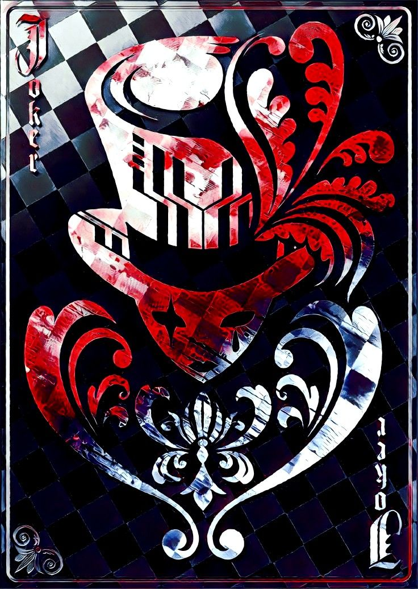

<!-- ============================== -->
<!-- BORDA SUPERIOR -->
<!-- ============================== -->

<br>

<!-- ============================== -->
<!-- TÍTULO ANIMADO -->
<!-- ============================== -->
<p align="center">
  <a href="https://git.io/typing-svg">
    
  </a>
</p>

<!-- ============================== -->
<!-- BIO / STATUS -->
<!-- ============================== -->


```csharp
----------------------˚₊‧꒰ა ☆ ໒꒱ ‧₊˚------------------------------

Username: Satirically
WhoIAm: Someone with a dark and biting sense of humor who
uses satire to subtly criticize people. I enjoy pointing out
mistakes and suggesting improvements.

Hobbies: Programming, gaming, singing, learning useless
things, and feeding my hyperfixations.

Games: Roblox, Minecraft, Brawl Stars, Bloons TD 6,
deeeep.io, Celeste.

Interests: AI, Linux, Machines, Scripting.
------------------------------------------------------------------
```
<br><br>

<!-- ============================== -->
<!-- GITHUB STATS + DAILY QUOTE -->
<!-- ============================== -->
<table width="100%" cellpadding="0" cellspacing="0" border="0">
 <tr>
    <td align="center">
      <a href="https://github.com/satiricosorridente">
        
      </a>
      <br>
      <a href="https://github.com/satiricosorridente">
        
      </a>
    </td>
    <td width="49%" valign="middle" align="center">
      <p align="center">
        <b>Daily Quote</b>
        
      </p>
      
    </td>
  </tr>
</table>
<br>

<!-- ============================== -->
<!-- FAVORITE SONGS -->
<!-- ============================== -->

<h3 align="center">Favorite Songs</h3>
<hr>
<br>

<table align="center" cellpadding="15" cellspacing="0" border="0">
  <tr>
    <td align="center">
      <a href="https://www.youtube.com/watch?v=iCPm55hqA3k&list=RDiCPm55hqA3k&start_radio=1">
        
      </a>
      <br><b>Living Hell - Bella Poarch</b>
    </td>
    <td align="center">
      <a href="https://www.youtube.com/watch?v=HxtMh-MpRog&list=RDHxtMh-MpRog&start_radio=1">
        
      </a>
      <br><b>Ft - Funkist</b>
    </td>
    <td align="center">
      <a href="https://www.youtube.com/watch?v=J_6mL_F3xjM&list=RDJ_6mL_F3xjM&start_radio=1">
        
      </a>
      <br><b>Rap do Ayankoji - Daarui</b>
    </td>
  </tr>
  <tr>
    <td align="center">
      <a href="https://www.youtube.com/watch?v=h4HkXR3NSI4&list=RDh4HkXR3NSI4&start_radio=1">
        
      </a>
      <br><b>Brain - Kanaria</b>
    </td>
    <td align="center">
      <a href="https://www.youtube.com/watch?v=h4HkXR3NSI4&list=RDh4HkXR3NSI4&start_radio=1">
        
      </a>
      <br><b>Monster - Skillet</b>
    </td>
    <td align="center">
      <a href="https://www.youtube.com/watch?v=UwLRDMQYh9M&list=RDUwLRDMQYh9M&start_radio=1">
        
      </a>
      <br><b>Give it Up - Victorious</b>
    </td>
  </tr>
</table>

<hr>
<br>

<!-- ============================== -->
<!-- ANIMES / ANILIST -->
<!-- ============================== -->



<br clear="both">
<br><br>

<div align="center">
  <a href="https://github.com/kawarimidoll/typograssy">
    
  </a>
</div>
<br><br>
<hr>

<!-- ============================== -->
<!-- LANGUAGES -->
<!-- ============================== -->
<h3 align="center">Languages</h3>
<p align="center">
  
  
  
  
  
  
  
  
  
  
  
</p>

<!-- ============================== -->
<!-- TOOLS -->
<!-- ============================== -->
<h3 align="center">Tools</h3>
<p align="center">
  
  
  
  
  
  
  
  
  
  
  
  
  
  
  
  
  
</p>

<!-- ============================== -->
<!-- CONTATOS -->
<!-- ============================== -->
<h3 align="center">Contactss</h3>
<p align="center">
  <a href="mailto:justonrloveornothing@gmail.com">
    
  </a>
  <a href="https://tiktok.com/@user4736903473099">
    
  </a>
  <a href="https://www.reddit.com/user/Annual_Feature_9320/">
    
  </a>
  <a href="https://www.youtube.com/@Sat%C3%ADricoMaldito">
    
  </a>
</p>
<br>

<!-- ============================== -->
<!-- CONTRIBUTION GRAPH (SNAKE) -->
<!-- ============================== -->
<h3 align="center">Contribution Graph</h3>
<p align="center">
  
</p>

<h3 align="center">Visitas</h3>
<p align="center">
  
</p>

<!-- ============================== -->
<!-- BORDA INFERIOR -->
<!-- ============================== -->

